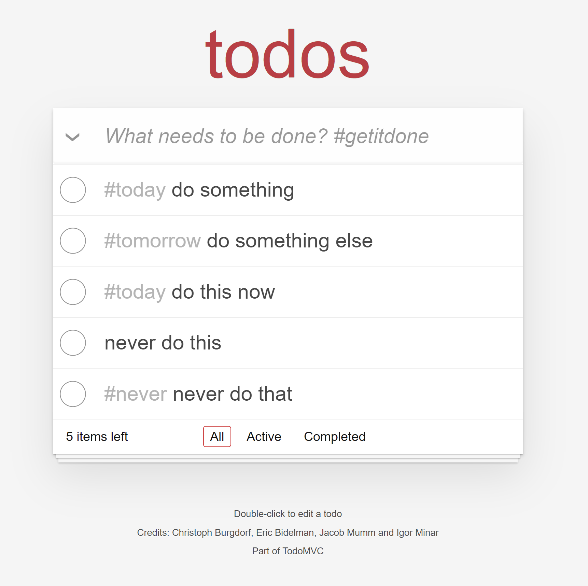

# FOLD ToDo App Demo
## Front End from AngularJS Demo on [ToDoMVC.com](https://todomvc.com/examples/angularjs/#/) ([source repo](https://github.com/tastejs/todomvc/tree/gh-pages/examples/angularjs))    

### Added Feature: Tagging
#### feature: 
* in-line hashtags can be added on todo-list item creation
* item can be modified with more hashtags
* tag can be clicked to filter the view for items with matching tags
* can filter by multiple tags
#### limitations:
* no backend implemented or integrated  
* no tests written for new feature  
#### areas for improvement:
* design function should be more immediately intuitive
* tags should have auto-completion if already extant

## Running the app
##### runs locally on localhost:8080
### Docker (Linux/WSL)
```bash
git clone https://github.com:defurn/todo-angular.git
cd todo-angular
./start.sh # build and run in container
```
### Node.js
uses Express server
```bash
git clone https://github.com:defurn/todo-angular.git
cd todo-angular
npm install
npm start
```
### Online
demo hosted on heroku [here](https://tranquil-mountain-17858.herokuapp.com/)  


